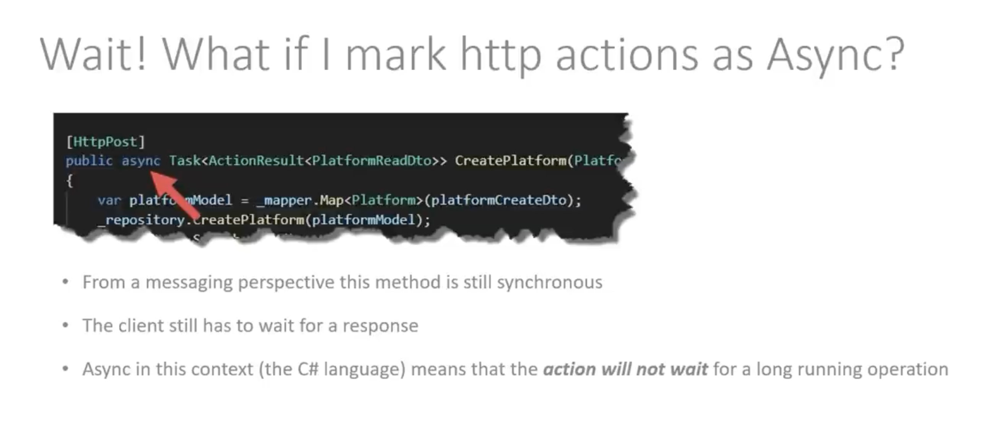

##### Asynchromous in C# Context
- Where an operation is started and completed at a later time

Using async and await keywords does not turn the operation to an asynchronous operation.
Using a message broker like RabbitMQ or Kafka does turn the operation to an asynchronous operation.

- Asynchronous use a model like Publish/Subscribe or Producer/Consumer to send and receive messages.
- Services do not need to know about each other

Whereas synchronous communication uses a request/response model,services need to know about each other i.e
- Service A needs to know about Service B
- Service B needs to know about Service C
- Service C needs to know about Service D
For example a User service needs to know about an Order service to get the orders for a user.

##### Build the docker image
Ensure you dont use CAPS in the docker id or else it will fail.
Ensure you use your docker id from docker hub as the prefix for the image name if you want to push it to docker hub.
- docker build -t <your docker id>/commandservice .
- docker build -t drsimplegraffiti/commandservice .

##### Push the docker image to docker hub
- docker push <your docker id>/commandservice
- docker push drsimplegraffiti/commandservice

##### Run the docker image
- docker run -p 8080:80 <your docker id>/commandservice
- docker run -p 8080:80 drsimplegraffiti/commandservice
