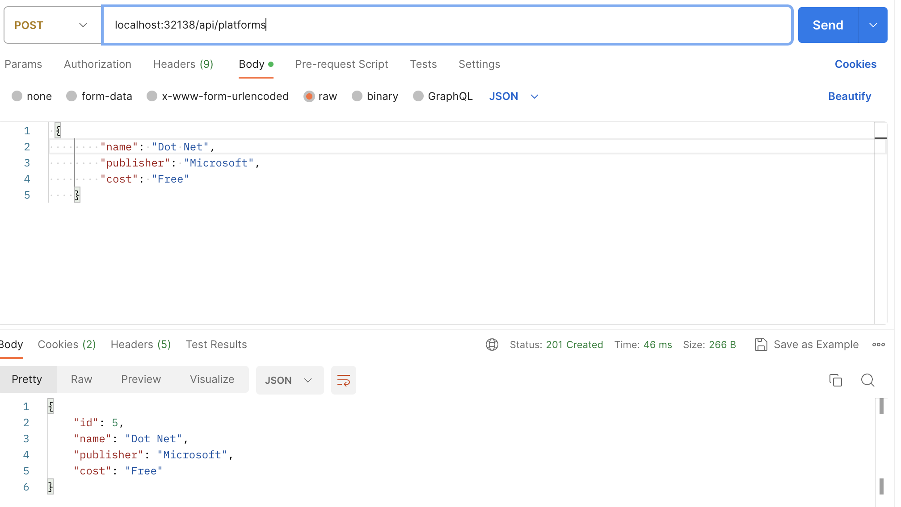

##### Create a new project
dotnet new webapi -n PlatformService

##### Open the project recursively
- code r PlatfromService


##### Add packages
- dotnet add package AutoMapper.Extensions.Microsoft.DependencyInjection
- dotnet add package Microsoft.EntityFrameworkCore
- dotnet add package Microsoft.EntityFrameworkCore.Design
- dotnet add package Microsoft.EntityFrameworkCore.InMemory
- dotnet add package Microsoft.EntityFrameworkCore.SqlServer

##### Models
They are internal representation of data. They are used to transfer data between different layers of the application. They are not exposed to the outside world.

#### DTOs
They are used to transfer data between the application and the outside world. They are exposed to the outside world.
They are the external representation of data.

##### Build the project
- dotnet build

Note: dotnet run will build the project and run it.

##### Dockerize the project
```docker
#See https://aka.ms/containerfastmode to understand how Visual Studio uses this Dockerfile to build your images for faster debugging.

FROM mcr.microsoft.com/dotnet/aspnet:7.0 AS base
WORKDIR /app
EXPOSE 80
EXPOSE 443

FROM mcr.microsoft.com/dotnet/sdk:7.0 AS build
WORKDIR /src
COPY ["PlatformService.csproj", "."]
RUN dotnet restore "./PlatformService.csproj"
COPY . .
WORKDIR "/src/."
RUN dotnet build "PlatformService.csproj" -c Release -o /app/build

FROM build AS publish
RUN dotnet publish "PlatformService.csproj" -c Release -o /app/publish /p:UseAppHost=false

FROM base AS final
WORKDIR /app
COPY --from=publish /app/publish .
ENTRYPOINT ["dotnet", "PlatformService.dll"]

```

##### Build the docker image
Ensure you dont use CAPS in the docker id or else it will fail.
Ensure you use your docker id from docker hub as the prefix for the image name if you want to push it to docker hub.
- docker build -t <your docker id>/platformservice .
- docker build -t drsimplegraffiti/platformservice .

##### Run the docker image
- docker run -d -p 8080:80 --name platformservice drsimplegraffiti/platformservice
<!-- - docker run -d -p 8080:80 drsimplegraffiti/platformservice -->

CONTAINER ID   IMAGE                      COMMAND                  CREATED          STATUS          PORTS                           NAMES
e245b946d194   drsimplegraffiti/platformservice   "dotnet PlatformServ…"   15 seconds ago   Up 14 seconds   443/tcp, 0.0.0.0:8080->80/tcp   platformservice

Note: 8080 is the port on the host machine and 80 is the port on the container.

##### Check the logs
- docker logs -f platformservice

##### Stop the container
- docker stop platformservice
- docker stop e245b946d194

##### Start the container
- docker start platformservice
- docker start e245b946d194

##### Remove the container
- docker rm platformservice
- docker rm e245b946d194

##### Remove the image
<!-- - docker rmi drsimple/platformservice -->
- docker rmi drsimplegraffiti/platformservice -f

##### Push the image to docker hub
- docker push drsimplegraffiti/platformservice

Note: You need to login to docker hub before pushing the image.
- docker login

##### Pull the image from docker hub
- docker pull drsimple/platformservice


##### Visit the browser using the mapped docker port
- http://localhost:8080/api/platforms

##### Kubernetes Architecture


##### Setup Kubernetes Solution
Ensure you have a root folder that contains the following folders:
- PlatformService
- k8s


##### K8S Deployment
In the root folder create a file called platform-depl.yaml
i.e E1/K8S/platform-depl.yaml
```yaml
apiVersion: apps/v1
kind: Deployment
metadata:
  name: platforms-depl
spec:
  replicas: 1
  selector:
    matchLabels:
      app: platformservice
  template:
    metadata:
      labels:
        app: platformservice
    spec:
      containers:
        - name: platformservice
          image: drsimplegraffiti/platforms:latest
          # ports:
          #   - containerPort: 5000
```

##### Spin up 3 Replicas
```yaml
apiVersion: apps/v1
kind: Deployment
metadata:
  name: platforms-depl
spec:
  replicas: 3
  selector:
    matchLabels:
      app: platformservice
  template:
    metadata:
      labels:
        app: platformservice
    spec:
      containers:
        - name: platformservice
          image: drsimplegraffiti/platforms:latest
          # ports:
          #   - containerPort: 5000
```

Note: Ensure that Kubernetes is running in the background on Docker Desktop.


Check if kubctl is installed
- kubectl version
Then cd into the k8s folder and run the following command
- kubectl apply -f platforms-depl.yaml


##### K8S Get 
- kubectl get deployments

Note: 
- The k8s_POD_platforms-depl-66c5d5b577-vlhhd_default_c4aec3a0-1f90-44d8-8267-de9d91d0dbfe_0 is the pod name.
- k8s_platformservice_platforms-depl-66c5d5b577-vlhhd_default_c4aec3a0-1f90-44d8-8267-de9d91d0dbfe_0 is the actual container name.
Click on the service and you will see the following:


If a container crashes, Kubernetes will automatically restart it and give it a new name.


##### Delete a deployment
- kubectl delete deployment platforms-depl

##### Get pods
- kubectl get pods


##### Get logs
- kubectl logs <pod name>

##### Get services
- kubectl get services

##### Delete all deployments
- kubectl delete deployments --all


---

##### Create a NodePort Service to expose the container to the outside world
In the K8S folder create a file called platforms-np-srv.yaml
```yaml
apiVersion: v1
kind: Service
metadata:
  name: platformnpservice-srv
spec:
  selector:
    app: platformservice # this is the name of the deployment coming from platforms-depl.yaml
  ports:
    - name: platformnpservice 
      protocol: TCP
      port: 80 # this is the port that the service is listening on
      targetPort: 80 # this is the port that the container is listening on
  type: NodePort
```


##### Apply the service
Ensure you are in the k8s folder
- kubectl apply -f platforms-np-srv.yaml  

[Note: This will create a service that will expose the container to the outside world]
To access the service external we need the  80:32138/TCP port. The 80 is the port on the host machine and 32138 is the port on the container.

So if we visit the following url we will be able to access the service:
- http://localhost:32138/api/platforms

##### Get the service
- kubectl get services

##### Delete the service
- kubectl delete service platformnpservice-srv

##### Delete all services
- kubectl delete services --all

##### Delete all deployments
- kubectl delete deployments --all


##### Create a Table using the port from this readme showing the port mapping for Local, Docker and Kubernetes
| Local | Docker | Kubernetes |
| --- | --- | --- |
| 5000 | 80 | 32138 |


---

##### Building the command service and dockerizing it
Ensure you are in the CommandService folder
- dotnet new webapi -n CommandService


##### Resolve `Specify which project file to use because /Users/abayomiogunnusi/Desktop/arca/E1/PlatformService contains more than one project file.`
dotnet build -p PlatformService.csproj
dotnet run -p PlatformService.csproj

##### rollout kube deployment
Create a new appsettings.Production.json file in the root folder
```json
{
  "CommandService": "http://commands-clusterip-srv:80/api/c/Platforms"
}
```
To allow and apply changes to the deployment file
- kubectl rollout restart deployment platforms-depl

